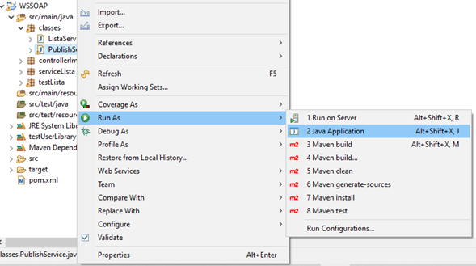

# Prueba Tecnica Allware
### Prueba Técnica Allware Julio 2022
## Guía de ejecución.

Para comenzar se debe descargar el repositorio.
Con el IDE preferido se debe abrir el código fuente del proyecto WSSOAP y dirigirse a: src/main/java/classes/PublishService.java como se puede apreciar en la imagen 1.

 

Imagen 1. Contenido proyecto WSSOAP desde el IDE Eclipse.

Se debe hacer click derecho sobre la clase “PublishService.java” y luego dirigirse a “Run as” y finalmente hacer click en “2 Java Application”, como se puede apreciar en la imagen 2.

 

Imagen 2. Publicando los servicios en un “contrato” WSDL.

Se puede ver el contenido del contrato WSDL en la dirección: http://localhost:1516/WS/PruebaTecnica?wsdl , una vista previa del contenido se aprecia en la imagen 3.
 

 

Imagen 3. Contenido contrato WSDL.

Con esto realizado se tienen los servicios publicados y funcionando.
Para consumir estos servicios esta el proyecto llamado ClienteSOAP.
Con su IDE preferido debe importar este proyecto.
Una vez importado, se debe dirigir en su IDE al directorio: src/pruebatecnica.services.v1.ListaService y luego a la clase “UserClientSOAP” donde se encontrará con un código de prueba prescrito donde se utilizan las principales funciones de forma clara y sencilla. Se puede ver el contenido en la imagen 4.

 

Imagen 4. Contenido de la clase “UserClientSOAP.java”.

Otra forma de probar la ejecución es a través de la clase “UserClientSOAPConsola.java” donde existe un menú donde se puede utilizar. Destacar que a pesar de que el contenido de los Nodos dentro de la lista es genérico y puede ser cualquier tipo de archivo, el contenido que se debe ingresar en el menú aplicativo por consola debe ser de tipo String. Esto es debido a que para efectos prácticos se programo el menú solo para recibir String’s, pero como se puede apreciar en “UserClientSOAP.java” la biblioteca creada recibe el contenido del Nodo como Object, por lo cual acepta cualquier tipo de Objeto acorde a los lineamientos de Java.
Se puede apreciar en la imagen 5 el menú del aplicativo por consola.

 

Imagen 5. Menú de pruebas de la clase “UserClientSOAPConsola.java”.

